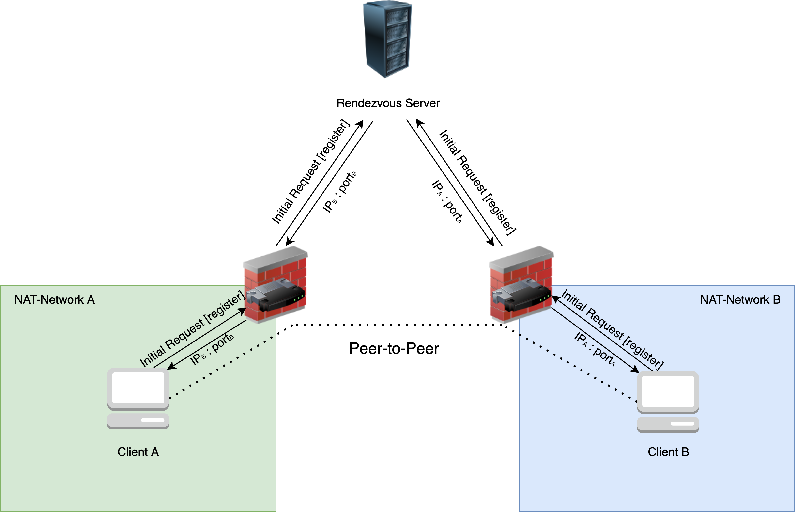
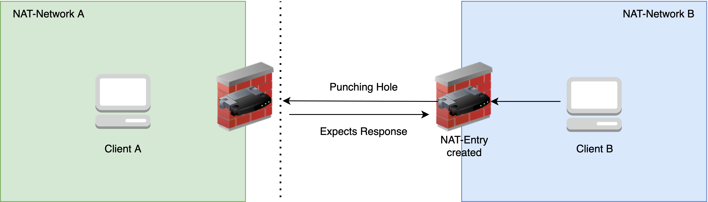

# udpeer Punch

## Motivation and Goal
The application should demonstrate the purpose and functionality of udp hole punching. 
It provides a simple CLI UDP messaging application written in go. 

***

## UDP Hole Punching 
- Peer-to-Peer connection between clients sitting directly behind a firewall 



1. Both clients initiate connection with Rendezvous Server through sending "register" Datagram
2. Rendezvous Server exchanges clients IPs and ports
3. Client A sends Datagram to the IP and port he received by the Rendezvous Server (Client B)
    - Network A's Firewall creates NAT entry expecting an answer by Client B 
    - Network B's Firewall blocks the incoming Datagram 
    - The hole has been punched!
4. Client B sends Datagram to the IP and port he received by the Rendezvous Server (Client A)
    - Network B's Firewall creates NAT entry expecting an answer by Client A 
    - The hole has been punched! 
5. Connection is established



***
## Deployment 

### Requirements 
- Needs a public accessible Server 
- Needs two clients in different networks, each protected by a firewall
- Executable needs to be build for different os architectures
```Bash
# Build a executable for local architecture 
go build 
```

### Usage

Server: 
```Bash
./udpeerPunch s
```

Client 1: 
```Bash
./udpeerPunch c <ip_of_server>:<port_of_server>
```

Client 2:
```Bash
./udpeerPunch c <ip_of_server>:<port_of_server>
```

## Credits & Collaborators